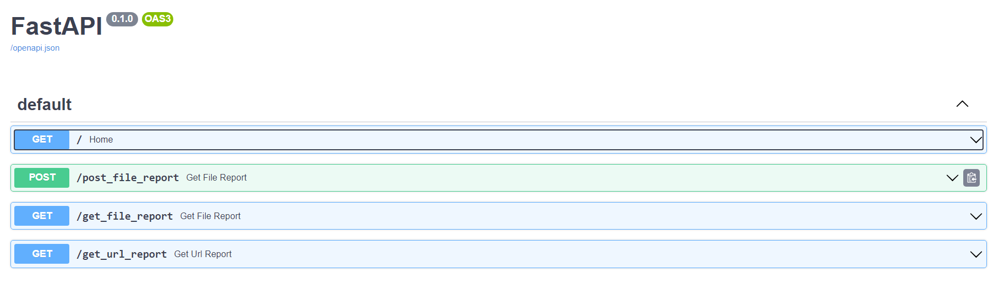
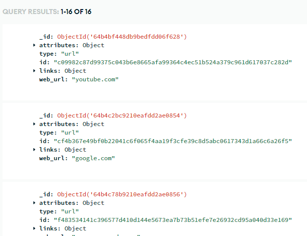
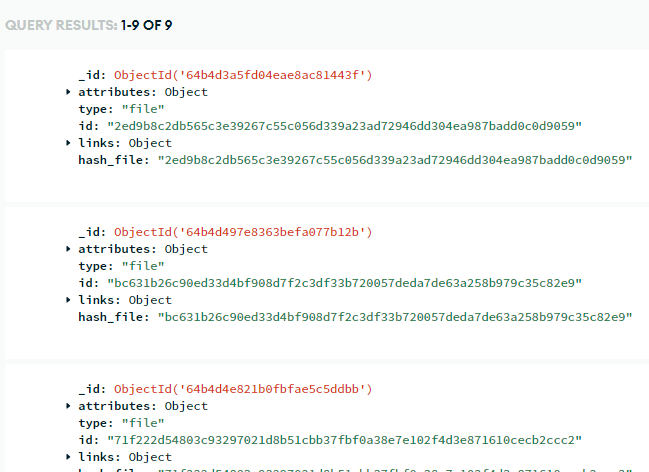

# senior-project-mds-api
 
# Malware Detection System - API

## About the project

Allows users to scan hyperlinks and files to detect malware

## Built with:

- FastAPI
- MongoDB

## Screenshots
### FastAPI

### MongoDB
**URL Collection**

**File Collection**
